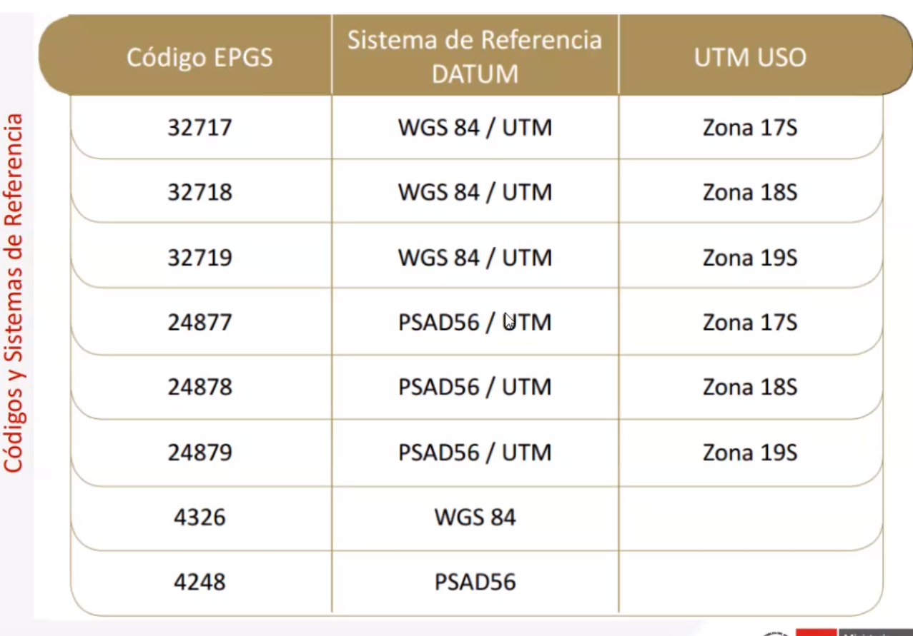
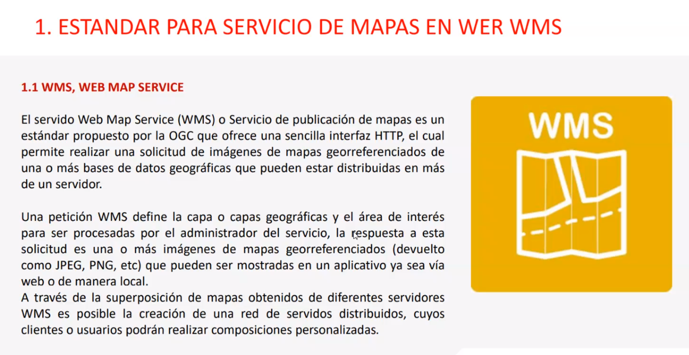
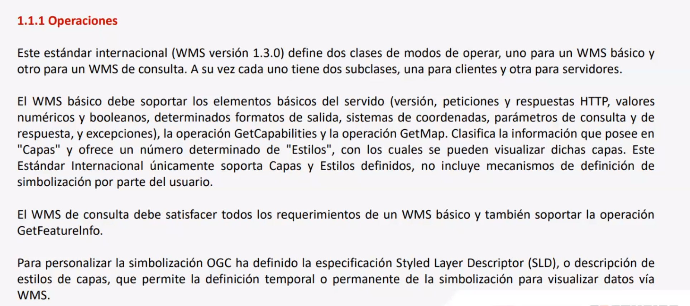
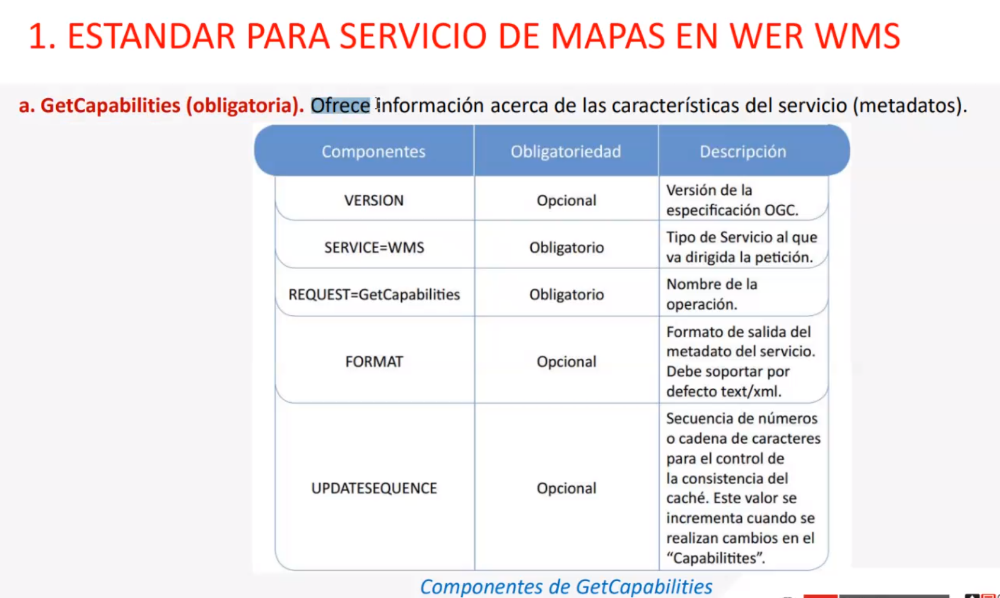

# Web Map Services

Estándares de servicios web de inforkación georreferncuada para el intercambio de datos entre 
entidades de la administración pública.

Las Web map services es una forma de publicación de mapas que es estándar, fue propuesto por la ogc y se basa en interfaz http donde el cliente hace la petición de las imágenes (pdf, png, jpg ,tiff) uno o varios servidores pueden responder la petición del cliente y este con tantos mapas puede hacer sus composiciones personalizadas, en pocas palabras la entrega de información viene de todas partes y no se centraliza.

Un WMS es generalmente una imágen

Operaciones, Existe wms básico y de consulta...
El básico ofrece, versión, perticiones, respuestas http, valoes numéricos y booleanos, determinados formatos de salida, sistemas de coordenadas, parámetros de consulta y de respuesta, además de excepciones. Las operaciones que debe soportar son GetCapabilitie y GetMap.
Pero el de consulta de ofrecer todo lo que ofrece el básico pero además debe soportar la operación GetFeatureInfo.

Para que estos mapas se vean personalizados la OGC presenta el formato de estilos Styled Layer Descriptor o SLD.

* GetCapabilities
* GetMap
* GetFeatureInfor

¡RECOMENDACIONES! > full lower case

## GetCapabilities

Ofrece información cerca de las caracterpisticas del servicio (metadatos)

## GetMap

Ofrece información cerca de las caracterpisticas del servicio (metadatos)

