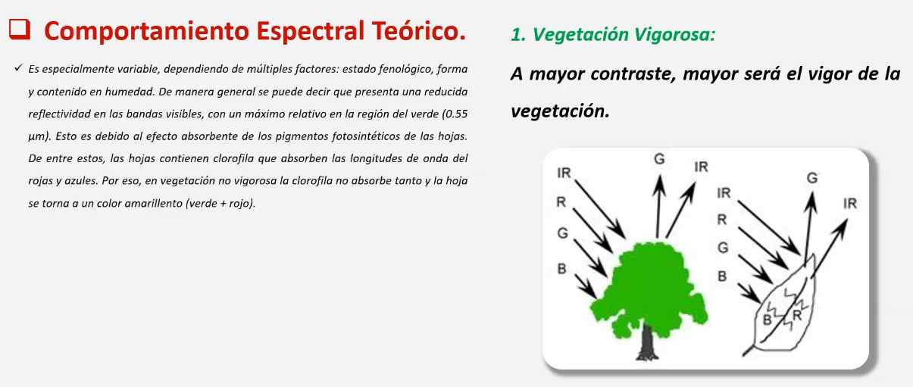
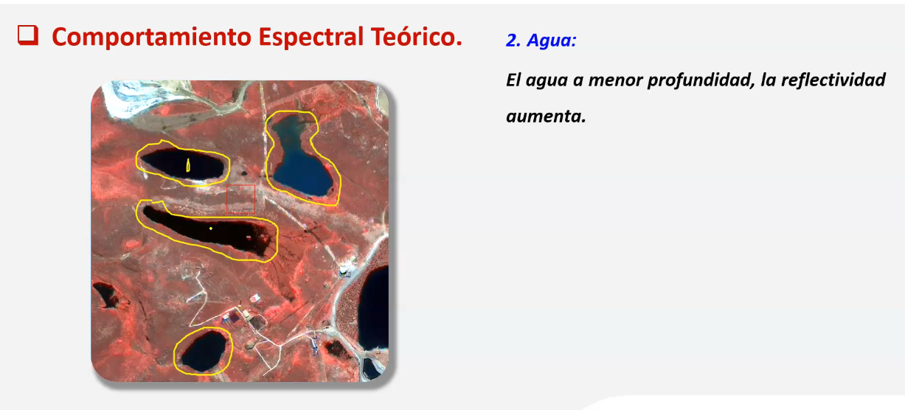
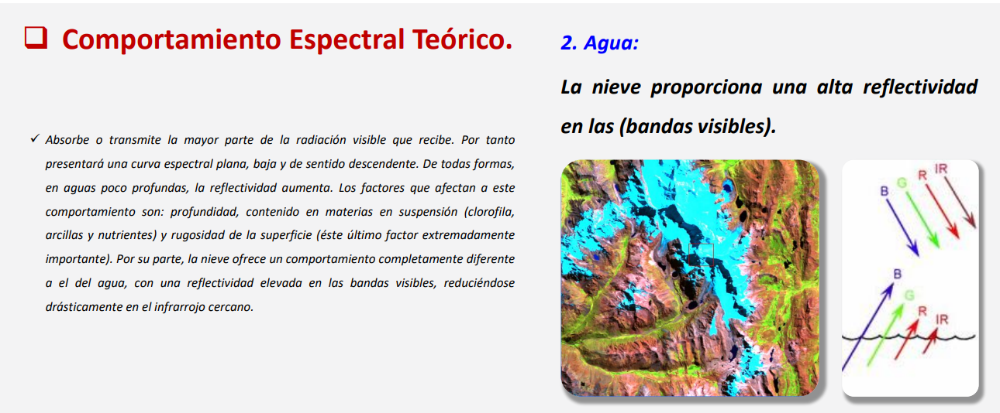
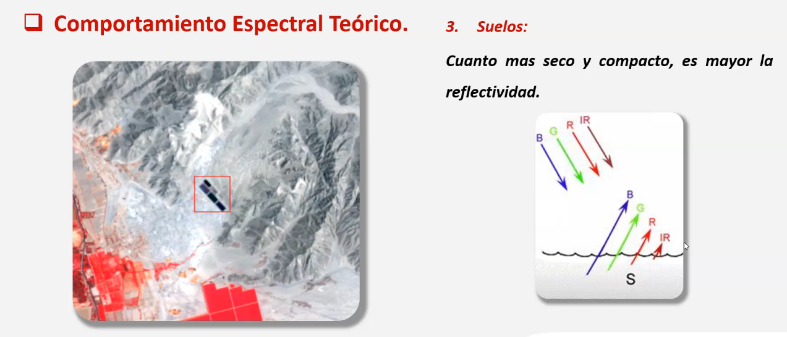
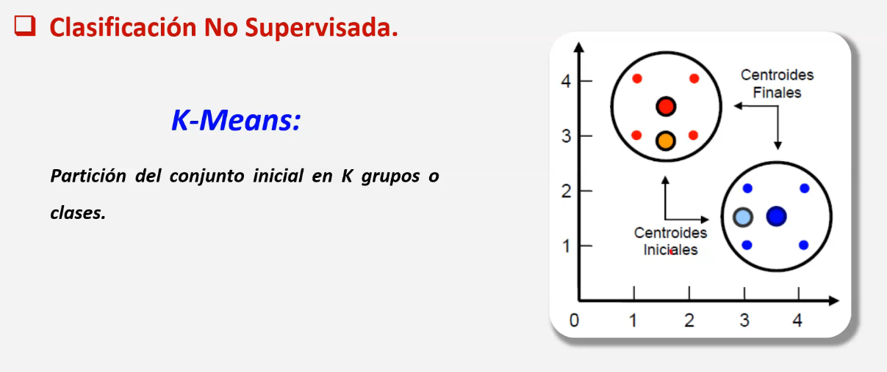
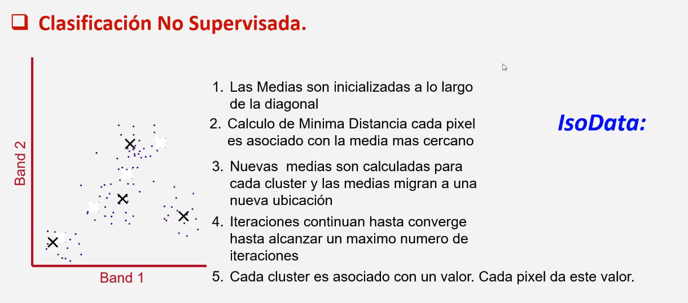
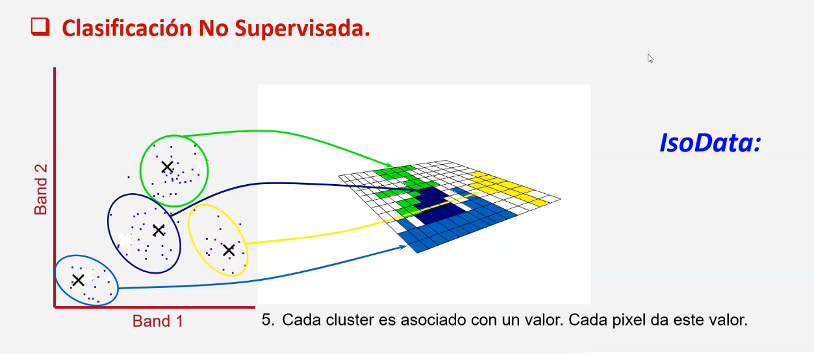

# Clasificación no supervisada
Reconoce y subdivide la escena en todos sus diferentes elementos.

Unas clasificación es aquel método en el que me permite hacer una agrupación finita de pixeles,
si un pixel se identifica con características especiales, entonces, ese pixel será asignado 
al grupo de pixeles al que pertenece por sus características.

### Comportamiento espectral teórico
Para los tres fundamentales o básicos, (vegetación, agua y suelo). 

* Vegetación vigorosa: a mayor contraste (mas oscura) mayor será el vigo de la vegetación.

 

* Agua: El agua a menor profundidad o menor volumen la reflectividad aumenta. Esto se debe
 a que el agua en poco volumen la energía que incide carga a este elemento de la suficiente
 energía que en su momento ya no podría contener mas, del mismo modo cuando se trata de un
 gran volumen de agua (como en el mar), es suficiente como para tomar energía indefinidamente. 

La relación entre reflectividad y absorción es inversamenter proporcional, es decir,
 un cuerpo que absorve mucha energía relfejará la energía que queda, que es poca, al
 mismo tiempo un elemento que relfeje mucha energía quiere decir que absorve muy poca.

> A veces se da el caso que cuando el satélite toma cuerpos de agua pero
 en una toma ORTOGONAL, entonces los cuerpos de agua con poco volumen que
 en teoría deberían reflejar mayor energía se muestran en color oscuro. A
 tener en cuenta.

* Nieve: La nieve ofrece una alta reflectividad (en las bandas visibles).

* Suelos: Cuanto mas SECO Y COMPACTO sea mayor también será la reflectividad.

## Clasificación no supervisada
- K-means: Partición del conjunto inicial en K grupos o clases

En esye ejemplo, luego de haber suparado en una número de grupo pequeños (2) se
 generaliza y el grupo de rojos toma un amarillo y el grupo de azules toma un celeste
 son mas incluyentes cuando en menos clases se divide, y mas excluyentes en cuanto
 a mayor sea el grupo en el que se les quiera dividir.

- IsoData: Calcula la media de las clases, para esto hace iteraciónes, establece "clusters"
 para cada tipo de conjunto de pixeles y al momento de ver la clasificación estos pixeles
 dan el resultado de su cluster correspondiente. (la cantidad de iteraciones mientras mayor
 sea mejora la clasificación, sin embargo un numero exagerado de iteraciones da el mismo
 resultado que la imagen inicial).

